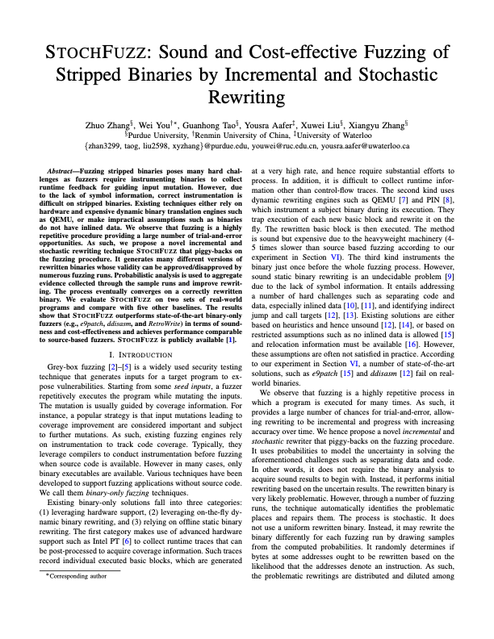

# StochFuzz: A New Solution for Binary-only Fuzzing

[](https://github.com/ZhangZhuoSJTU/StochFuzz/actions/workflows/basic.yml)
[](https://github.com/ZhangZhuoSJTU/StochFuzz/actions/workflows/benchmark.yml)

<p>
<a href="https://www.cs.purdue.edu/homes/zhan3299/res/SP21b.pdf"> </a>

StochFuzz is a (probabilistically) sound and cost-effective fuzzing technique for stripped binaries. It is facilitated by a novel incremental and stochastic rewriting technique that is particularly suitable for binary-only fuzzing. Any AFL-based fuzzer, which takes edge coverage (defined by AFL) as runtime feedback, can acquire benefits from StochFuzz to directly fuzz stripped binaries.
</p>
  
More data and the results of the experiments can be found [here](https://github.com/ZhangZhuoSJTU/StochFuzz-data).

## Clarifications

+ We adopt a new system design than the one from the paper. Details can be found at [system.md](docs/system.md).
+ In the paper, when we are talking about `e9patch`, we are actually talking about the binary-only fuzzing tool built upon e9patch, namely `e9tool`. Please refer to its [website](https://github.com/GJDuck/e9patch/blob/master/README.md#building) for more details.
+ Although StochFuzz does support Position-independent code (PIC), there are some implementation bugs which make fuzzing PIC binaries failed. I will fix them in one month (by the end of June 2021).


## Building StochFuzz

The dependences of StochFuzz can be built by [build.sh](https://github.com/ZhangZhuoSJTU/StochFuzz/blob/master/build.sh).
 
```bash
$ git clone https://github.com/ZhangZhuoSJTU/StochFuzz.git
$ cd StochFuzz
$ ./build.sh
```

StochFuzz itself can be built by GNU Make.

```bash
$ cd src
$ make release
```

## How to Use

StochFuzz provides multiple rewriting options, which follows the AFL's style of passing arguments.

```
$ ./stoch-fuzz -h
stoch-fuzz 1.0.0 by <zhan3299@purdue.edu>

./stoch-fuzz [ options ] -- target_binary [ ... ]

Mode settings:

  -S            - start a background daemon and wait for a fuzzer to attach (defualt mode)
  -R            - dry run target_binary with given arguments without an attached fuzzer
  -P            - patch target_binary without incremental rewriting
  -D            - probabilistic disassembly without rewriting
  -V            - show currently observed breakpoints

Rewriting settings:

  -g            - trace previous PC
  -c            - count the number of basic blocks with conflicting hash values
  -d            - disable instrumentation optimization
  -r            - assume the return addresses are only used by RET instructions
  -e            - install the fork server at the entrypoint instead of the main function
  -f            - forcedly assume there is data interleaving with code
  -i            - ignore the call-fallthrough edges to defense RET-misusing obfuscation

Other stuff:

  -h            - print this help
  -x execs      - set the number of executions after which a checking run will be triggered
                  set it as zero to disable checking runs (default: 200000)
  -t msec       - set the timeout for each daemon-triggering execution
                  set it as zero to ignore the timeout (default: 2000 ms)
  -l level      - set the log level, including INFO, WARN, ERROR, and FATAL (default: INFO)

```

__It is worth first trying the [advanced strategy](#advanced-usage) because it is much more cost-effective.__

### Basic Usage

To fuzz a stripped binary, namely `example.out`, we need to `cd` to the directory of the target binary. For example, if the full path of `example.out` is `/root/example.out`, we need to first `cd /root/`. Furthermore, _it is dangerous to run two StochFuzz instances under the same directory._ These restrictions are caused by some design faults and we will try to relax them in the future. 

Assuming StochFuzz is located at `/root/StochFuzz/src/stoch-fuzz`, execute the following command to start rewriting the target binary.

```bash
$ cd /root/
$ /root/StochFuzz/src/stoch-fuzz -- example.out # do not use ./example.out here
```

After the initial rewriting, we will get a phantom file named `example.out.phantom`. This phantom file can be directly fuzzed by AFL or any AFL-based fuzzer. Note that the StochFuzz process would not stop during fuzzing, so please make sure the process is alive during fuzzing.

Here is a demo that shows how StochFuzz works.

[](https://asciinema.org/a/415987)

### Advanced Usage

Compared with the compiler-based instrumentation (e.g., afl-clang-fast), StochFuzz has additional runtime overhead because it needs to emulate each _call_ instruction to support stack unwinding.

Inspired by a recent [work](https://dl.acm.org/doi/abs/10.1145/3445814.3446765), we provide an advanced rewriting strategy where we do not emulate _call_ instructions but wrap the `_ULx86_64_step` function from [libunwind](https://github.com/libunwind/libunwind) to support stack unwinding. This strategy works for most binaries but may fail in some cases like fuzzing statically linked binaries.

To enable such strategy, simply provide a __-r__ option to StochFuzz.

```bash
$ cd /root/
$ /root/StochFuzz/src/stoch-fuzz -r -- example.out 
```

Addtionally, before fuzzing, we need to prepare the `AFL_PRELOAD` environment variable for AFL.

```bash
$ /root/StochFuzz/scritps/stochfuzz_env.sh # for zsh, run . /root/StochFuzz/scritps/stochfuzz_env.sh
$ AFL_PRELOAD=$STOCHFUZZ_PRELOAD afl-fuzz -i seeds -o output -t 2000 -- example.out.phantom @@
```

Following demo shows how to apply this advanced strategy.

[](https://asciinema.org/a/415990)

## Troubleshootings

Common issues can be referred to [trouble.md](docs/trouble.md). If it cannot help solve your problem, please kindly open a Github issue.

Besides, we provide some tips on using StochFuzz, which can be found at [tips.md](docs/tips.md)

## Development

Currently, we have many todo items and some pending decisions of improving StochFuzz. Details can be found at [todo.md](docs/todo.md). 

StochFuzz should be considered an alpha-quality software and it is likely to contain bugs. 

I will try my best to maintain StochFuzz timely, but sometimes it may take me more time to respond. Thanks for your understanding in advance.

## Cite

Zhang, Zhuo, et al. "STOCHFUZZ: Sound and Cost-effective Fuzzing of Stripped Binaries by Incremental and Stochastic Rewriting." 2021 IEEE Symposium on Security and Privacy (SP). IEEE, 2021.

## References

+ Duck, Gregory J., Xiang Gao, and Abhik Roychoudhury. "Binary rewriting without control flow recovery." Proceedings of the 41st ACM SIGPLAN Conference on Programming Language Design and Implementation. 2020.
+ Meng, Xiaozhu, and Weijie Liu. "Incremental CFG patching for binary rewriting." Proceedings of the 26th ACM International Conference on Architectural Support for Programming Languages and Operating Systems. 2021.
+ Aschermann, Cornelius, et al. "Ijon: Exploring deep state spaces via fuzzing." 2020 IEEE Symposium on Security and Privacy (SP). IEEE, 2020.
+ Google. “Google/AFL.” GitHub, github.com/google/AFL. 
