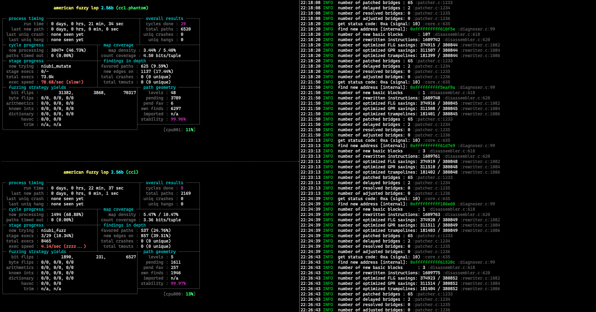
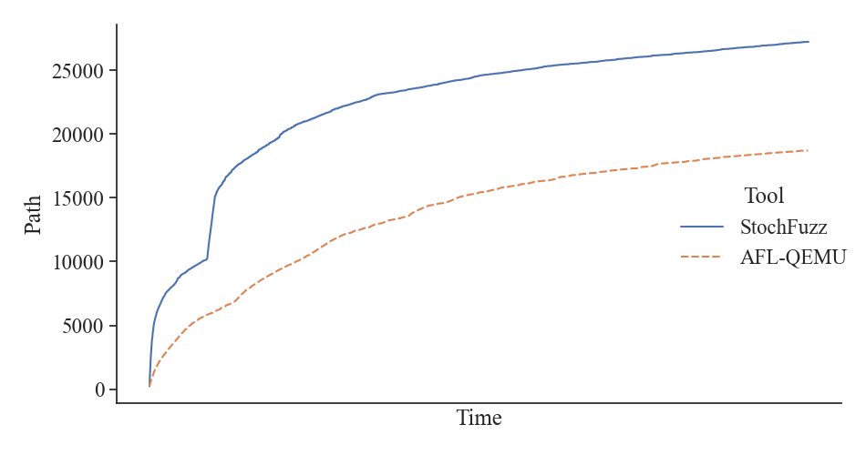
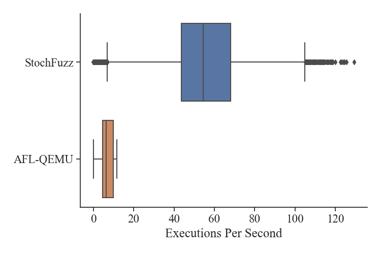

# New System Design

Originally, StochFuzz was integrated into AFL, which made an easy development. However, as more and more advanced fuzzing tools (e.g., [Polyglot](https://github.com/s3team/Polyglot)) take their own implementations (e.g., developing a new variant of AFL), it becomes hard to combine StochFuzz with these tools. 

As such, we decide to separate StochFuzz and AFL. With this new system design, any AFL-based fuzzer can directly fuzz the phantom binary generated by StochFuzz.

However, it also brings some new challenges. 

First of all, it is easy for the old design to keep multiple versions of rewritten binaries at the same time (by modifying AFL to set up multiple fork servers), but not for the new one. Currently, StochFuzz is independent of AFL, which means it can only keep a single binary at a time. Hence, to detect those erroneous rewriting errors only changing execution paths but not triggering crashes, we introduce a new technique named __checking executions__. These checking executions are triggered periodically and check the coverage consistency w/ and w/o uncertain patchings. After each checking execution, the rewritten binary will get changed. `-x` option is for checking runnings.

Besides, we need to manually set the timeout for StochFuzz, which should be consistent with the one of AFL. `-t` option is for the timeout.

A good observation is that the edge coverage is at the block level, which means we do not need to trap all instructions but one instruction per block. This observation helps us avoid many rewriting errors.

## Case: Polyglot

[Polyglot](https://github.com/s3team/Polyglot) is a state-of-the-art language fuzzer that focuses on testing compilers and language interpreters. Since many programming languages are bootstrapping, which means their language processors are written in themselves, it is difficult or time-consuming to instrument these processors (e.g., __GCC__). The developers of Polyglot originally used AF QEMU mode to test such processors. 

In this case study, we try to combine Polyglot with StochFuzz to provide a more efficient fuzzing test for GCC. 

Before starting our experiments, we need to make a slight change on StochFuzz. Since the developers of Polyglot extend the [size of AFL shared memory](https://github.com/s3team/Polyglot/blob/a49f67ffb95684ae2227800a85eb7963eeb2692d/AFL_replace_mutate/config.h#L323), we need to update it in StochFuzz accordingly.

Specifically, we need first to change [AFL_MAP_SIZE_POW2](https://github.com/ZhangZhuoSJTU/StochFuzz/blob/f90db25c300e79b9dd37748da883cb9d66a8253f/src/afl_config.h#L37) to 20. To avoid the conflicts of mmap, we additionally need to change [AFL_MAP_ADDR](https://github.com/ZhangZhuoSJTU/StochFuzz/blob/f90db25c300e79b9dd37748da883cb9d66a8253f/src/afl_config.h#L39). I change it to 0x180000 in this case. The new [afl_config.h](https://github.com/ZhangZhuoSJTU/StochFuzz/blob/f90db25c300e79b9dd37748da883cb9d66a8253f/src/afl_config.h) would look like:

```c
...
#define AFL_FORKSRV_FD 198
#define AFL_SHM_ENV "__AFL_SHM_ID"
#define AFL_MAP_SIZE_POW2 20 
#define AFL_MAP_SIZE (1 << AFL_MAP_SIZE_POW2)
#define AFL_MAP_ADDR 0x180000
#define AFL_PREV_ID_PTR (RW_PAGE_ADDR + 0x8)
#define AFL_MAP_SIZE_MASK ((1 << AFL_MAP_SIZE_POW2) - 1)
...
```

We apply the [advanced strategy](https://github.com/ZhangZhuoSJTU/StochFuzz#advanced-usage) of StochFuzz and run two GCC fuzzing instances, including `Polyglot + StochFuzz` and `Polyglot + AFL-QEMU`, for 24 hours.

### Screenshot



In the above screenshot, the top left and bottom left panels show the progresses of `Polyglot + StochFuzz` and `Polyglot + AFL-QEMU`, respectively. The right panel shows some logging information of StochFuzz.

In short, when running for around 20 minutes, StochFuzz can achieve 70 executions per second while AFL-QEMU only 4 executions per seconds. In the meantime, StochFuzz found 6520 paths, two times more than AFL-QEMU did (2169 paths). Our register liveness analysis helps StochFuzz avoid _98.4%_ saving/restoring for FLAGS register and _81.2%_ for general purpose registers.

### Results

<p float="center">
  
  
</p>

The left figure presents how many paths each tool found over time. The blue solid line is for StochFuzz and the orange dotted line is for AFL-QEMU. We can see at the end, StochFuzz found much more paths than AFL-QEMU.

The right figure presents the distribution of EPS (executions per second) of two tools, the blue one for StochFuzz and the orange one for AFL-QEMU. The average EPS of StochFuzz is around 60 executions per second, nearly 7 times faster than AFL-QEMU.
